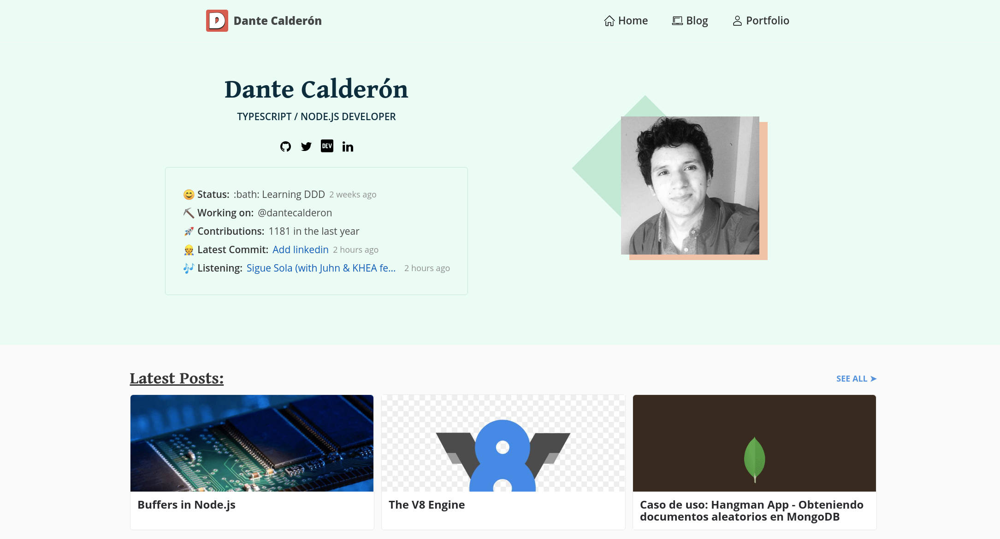

# Dante Calderón Personal Website
[](https://circleci.com/gh/dantehemerson/dantecalderon.com)
[](https://app.netlify.com/sites/dantecalderon/deploys)
[](https://stackshare.io/dantehemerson/dantecalderon-dev)
[](https://app.fossa.io/projects/git%2Bgithub.com%2Fdantehemerson%2Fdantecalderon.dev?ref=badge_shield)

Code of my personal static website were I write about Node, JS/Typescript, Backend development and more.



Deployed at: https://dantecalderon.dev

## 💪 Powered by:

* Built with [Gatsby](https://www.gatsbyjs.com/)
* Hosted in [Netlify](https://www.netlify.com/)

See complete stack in [StackShare](https://stackshare.io/dantehemerson/dantecalderon-dev)


## 💡 Features:
* [Blog](https://dantecalderon.dev/blog)
* [Portfolio](https://dantecalderon.dev/portfolio)
* [Dynamic status section](https://dantecalderon.dev/) supported via [my API](https://github.com/dantehemerson/api):
  - Github Status
  - Contributions in last year
  - Latest commit
  - Listening
* [Tech Stack Section](https://dantecalderon.dev/#my-stack)
* Share Post buttons
* TypeScript support
* [Page for ech Tag](https://dantecalderon.dev/blog/tags/backend)
* Comments supported by [Disqus](https://disqus.com/)

## 🚀 Run

Install packages
```bash
yarn
```

And run:
```bash
yarn start
```

## 💱 Changelog

**Screenshots**

- https://drive.google.com/drive/folders/1SKe0XkNrWMfgsuf66BzjWmVScmDZ95U5

## ⚖️ License

[MIT](./LICENSE)

[](https://app.fossa.io/projects/git%2Bgithub.com%2Fdantehemerson%2Fdantecalderon.dev?ref=badge_large)
