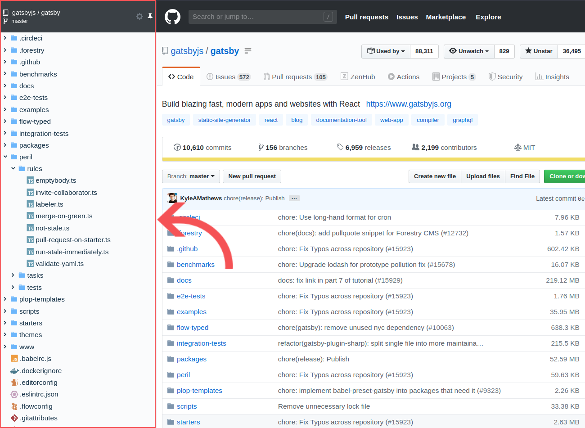
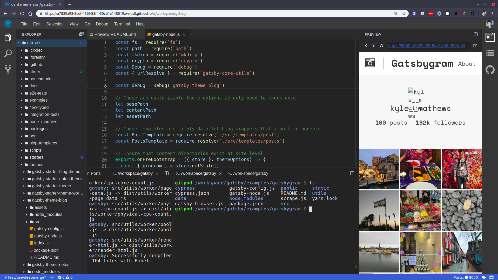
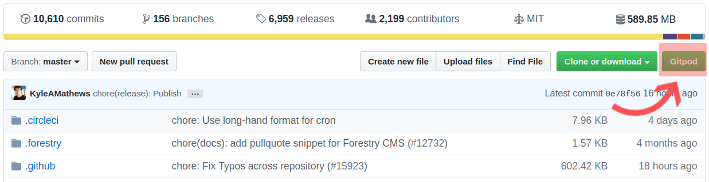

Los programadores pasamos mucho tiempo en Github explorando código, hoy te voy a compartir algunas herramientas que me han sido utiles para la exploracion de código en Github.

### 1.- [Octotree](https://www.octotree.io/)

Octotree es un plugin de **Chrome** nos permite tener un arbol de archivos para acceder facilmente a ellos.

### 2.- [Gitpod](https://gitpod.io)

Gitpod es una servicio que nos permite tener un editor online para repositorios en Github, esta basado es [VSCode](https://code.visualstudio.com/) por lo que la interfaz es muy parecida.

La integracion con Github es mediante un [plugin](https://chrome.google.com/webstore/detail/gitpod-online-ide/dodmmooeoklaejobgleioelladacbeki?hl=en) que añade un boton que crea facilmente un espacio de trabajo para un repositorio.

Es muy util ya que podemos trabajar desde cualquier computadora, además que es muy rápido ya que corre sobre un servidor.

### 3.- [GitHub Repository Size](https://chrome.google.com/webstore/detail/github-repository-size/apnjnioapinblneaedefcnopcjepgkci)

Muestra el peso de un repositorio y sus archivos.

