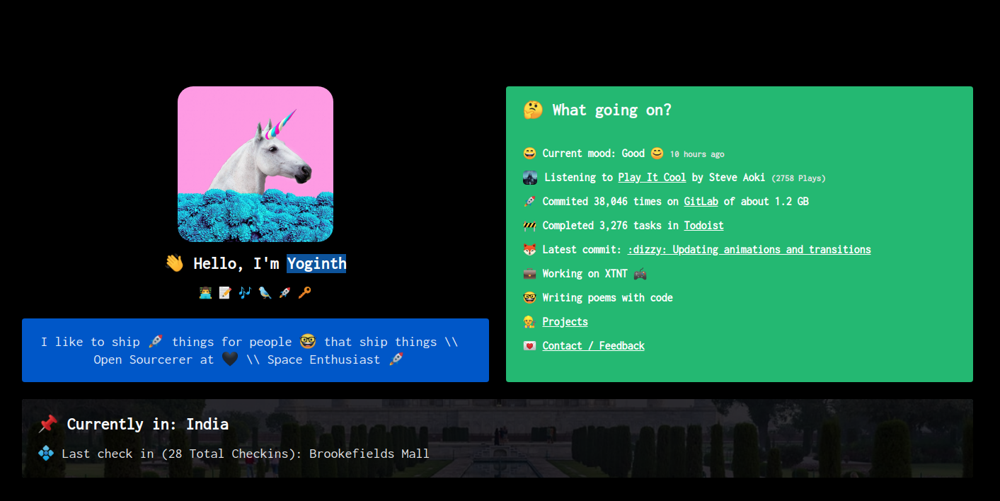
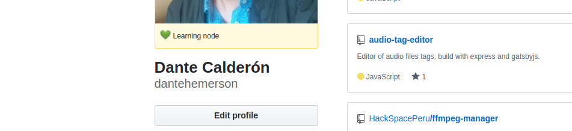

Estoy en el proceso de cambiar el estilo de mi [pagina de inicio](https://5d904aa582636f00090fd93e--dantecalderon.netlify.com/) que actualmente luce como arriba, pero quisiera agregarle mas informacion.

Me gusto la pagina de (Yoginth)[https://yoginth.com/], asi que la tomare de referencia.

Tiene informacion sobre:

- Su status actual(de Gitlab)
- La musica que actualmente esta escuchando(de Spotify)
- El cantidad de commits que ha hecho
- El total de tareas terminadas(de todoist)
- Su ultimo commit
- y actual trabajo(de Gitlab)

Asi que tambien quisiera hacer algo similar. Aun no tengo idea de como deberia ser el diseno.

Estoy en el proceso de obtener los datos.
Estoy usando GraphQL la API de [Github](https://developer.github.com/v4/), ya obtuve mi **status** desde Github(ahora permite poner status):

y quedo asi:

sin embargo aun tengo dificultades para obtener el ultimo de commit desde Github que no permite saber los commits en general. Estoy pensando en consultar todos los repos, obtener su ultimo commit y ordenarlos por fecha y asi obtener el ultimo.

En fin, ya encontrare una solucion.

Y aca esta un video de lo que estuve haciendo 😊:

`youtube: https://www.youtube.com/embed/-4eGiLDMyXs`

Peace ✌!!!
