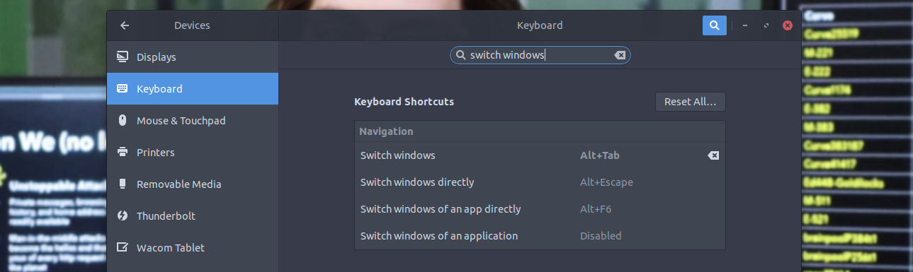

Estoy usando Ubuntu 18.04 y se me hacia muy complicando el cambiar entre pantallas usando `Alt+Tab`, ya que 
GNOME agrupa las ventanas por aplicacion y personalmente no estoy muy acostumbrado a ese comportamiento.

Asi buscando encontre estas configuraciones y extensiones que me ayudaron con eso.

> Disclaimer: Por supuesto esta es una opinion personal.

### 1.- No agrupar las ventanas

En Ubuntu 19 esto ya no es necesario ya que por defecto las ventanas estan desagrupadas, sin embargo 
en 18.4 tenemos que ir a `Settings -> Devices -> Keyboard` y buscamos `switch windows` y cambiamos el shortcut a
shorcut a `Alt+Tab`.

De esta manera podemos cambiar facilmente entre ventanas **no agrupadas** con `Alt+Tab`, y si queremos
cambiar entre ventanas por aplicacion lo hacemos con `Alt+``.

### 2.- Eliminar delay al cambiar entre ventanas

Otra de las cosas que me molestaba era que al cambiar entre ventanas habia un pequeno delay luego 
de presionar `Alt+Tab`.

Por suerte existe [Instant Switcher Popups](https://extensions.gnome.org/extension/1199/instant-switcher-popups/), esta extension de GNOME Shell elimina ese pequeno delay.

### 3.- VIM Alt-Tab

[VIM Alt-Tab](https://extensions.gnome.org/extension/2212/vim-alt-tab/) es una extension que nos permite usar `h, j, k, l` como en **VIM**  para movernos entre ventanas.

Funciona similar a usar las teclas `left y right -> (h y l)` luego de que presionamos `Alt+Tab` para movernos entre las
ventanas.

Es muy util ya que si tenemos muchas ventanas podemos movernos rapidamente y sin tener la necesidad de realizar 
ese moviemiento a las teclas de flecha.

--

Tener una buena experiencia en nuestro SO es muy importante ya que nos permite ser mas productivos. 
Te invito que te tomes el tiempo de configurar shorcuts, buscar herramientas y extesiones que te permitan mejorar tu experiencia en tu SO y ser mas productivo en tu dia.

Gracias por leer ✌.
