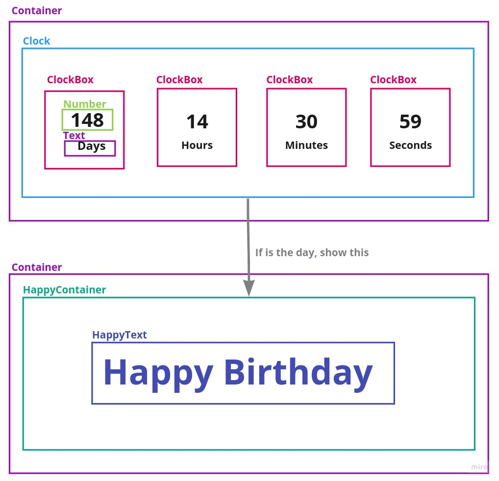

Las cosas que aprenderemos seran:

- Usar rutas dinamicas en Next.js
- Usar Typescript
- Usar styled-components
- Crear un sitio increible. 🚀

### Que vamos a hacer?

Hoy estaremos construyendo una pagina que nos ayude a saber cuantos **dias, horas y segundos**
faltan para nuestro cumpleanos o una cualquier otro cumpleanos.
Este sera el resultado final.

Puedes dar un vistaso a la demo y al codigo aca:

- [Demo](https://birthday-countdown.now.sh)
- [Code](https://github.com/dantehemerson/birthday-countdown)

Asi que vamos a ello...

### 💫 Creando el repositorio

Para asegurase que todo funcione correctamente, clonaremos el repositorio original y trabajar sobre el.
Para ello haremos lo siguiente:

```bash
# Clonamos el repositorio original y nos movemos a el folder creado
git clone git@github.com:dantehemerson/birthday-countdown.git && cd birthday-countdown

# Nos movemos al commit del principio
git reset --hard 658aed

# Reiniciamos el repo para no tener conflictos
rm -rf .git && git init

# Agregamos los cambios
git add --all && git commit -m "Initial commit"

```

### 🚀 Iniciando el proyecto

Primero instalamos los paquetes:

```bash
yarn
```

y para correr el proyecto usamos:

```bash
yarn dev
```

ahora podemos ver la pagina en http://localhost:3000

### 🎨 Preparando el fondo

Primero para que nuestro sitio se vea con estilo, vamos a agregar una imagen de fondo y vamos a centrar el contendio,
para esto vamos a nuestro componente contenedor(`Layout.tsx`).

Para la imagen de fondo usare [esta imagen](https://images.unsplash.com/photo-1588909741576-6ded462d06b9?ixlib=rb-1.2.1&auto=format&fit=crop&w=1950&q=80),
sientete libre de usar la que tu prefieras.
Y dentro del componente con estilo `Container` agregamos estos estilos:

```typescript{4-7}:title=components/Layout.tsx
const Container = styled.div`
  background: #f9fafa;
  height: 100vh;
  background-image: url('https://images.unsplash.com/photo-1588909741576-6ded462d06b9?ixlib=rb-1.2.1&auto=format&fit=crop&w=1950&q=80');
  background-repeat: no-repeat;
  background-attachment: fixed;
  background-position: center;
`
```

Y para centrar el centrar el contenido usaremos **flexbox**

```typescript{8-10}:title=components/Layout.tsx
const Container = styled.div`
  background: #f9fafa;
  height: 100vh;
  background-image: url('https://images.unsplash.com/photo-1588909741576-6ded462d06b9?ixlib=rb-1.2.1&auto=format&fit=crop&w=1950&q=80');
  background-repeat: no-repeat;
  background-attachment: fixed;
  background-position: center;
  display: flex;
  justify-content: center;
  align-items: center;
`
```

## 👷 Creando los componentes

Este es el esquema de los componentes:



Tenemos aca el componente `Container` que estara centrado en la pagina.
La logica sera:

```jsx
Es el dia de cumpleanos?
         /   \
       NO     SI
      /        \
  Mostrar    Mostrar
    /            \
<Clock/>    <HappyContainer/>
```

#### 🗳 ClockBox componente

Empezaremos creando el componente `ClockBox`, para ello vamos a crear el archivo en `components/ClockBox.tsx`.

```tsx:title=components/ClockBox.tsx
import React from 'react'
import styled from 'styled-components'

type ClockBoxProps = {
  count: string
  text: string
}

export const ClockBox = ({ count, text }: ClockBoxProps) => {
  return (
    <ClockBoxContainer>
      <Count>{count}</Count>
      <Text>{text}</Text>
    </ClockBoxContainer>
  )
}

const Count = styled.p``

const Text = styled.p``

const ClockBoxContainer = styled.div``
```

En este componente tendremos sera una caja que renderizara los dias, horas, minutos o segundos que faltan para el cumpleanos.

```tsx
type ClockBoxProps = {
  count: string
  text: string
}

export const ClockBox = ({ count, text }: ClockBoxProps) => {
```

Aca Creamos un tipo `ClockBoxProps` donde definimos que propiedades recibiremos y de que tipo son. Tenemos que `count` es de tipo `string`
y `text` es de tipo `string` tambien. Esto nos ayuda en la experiencia de desarrollo.

#### ⌚ Clock Component

El component `Clock` contendra 4 componentes `ClockBox` para los dias, horas, minutos y segundos.

```tsx:title=components/Clock.tsx
import React from 'react'
import styled from 'styled-components'
import { ClockBox } from './ClockBox'

export const Clock = () => {
  return (
    <ClockContainer>
      <ClockBox count={'12'} text="Hours" />
    </ClockContainer>
  )
}

const ClockContainer = styled.div``
```
