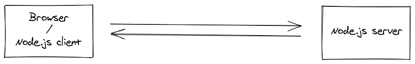

Socket.IO is a library to build Real-Time services with Node.js. It's built over the Websocket protocol, we are going to talk about it later.

It consists of a Server built with Nodejs and a Client in Javascript(Also you can use Node.js, Python, C++, etc).

At this time we are going to explore the Server, so let's go...

### WebSockets

WebSocket is a communcation protocol that provides a full-duplex communication channels over a single TCP connection.

It enables interaction between a client(e.g. a web browser) and a web server maintaining open communication between both. Either client and **server** can send data to the other hand, it facilitates the real-time data transfer with lower overhead and it makes a better alternative to HTTP polling.

**Why where created?**
