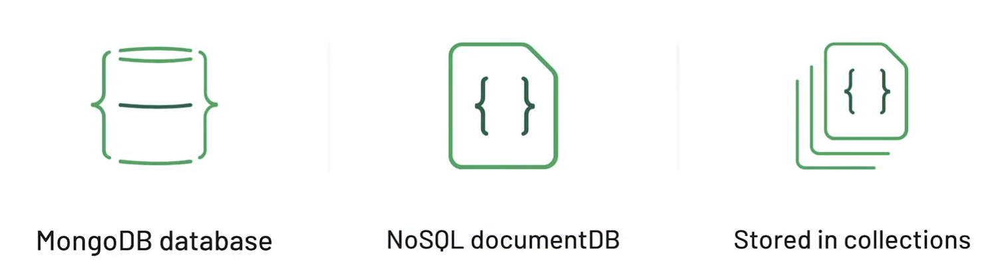
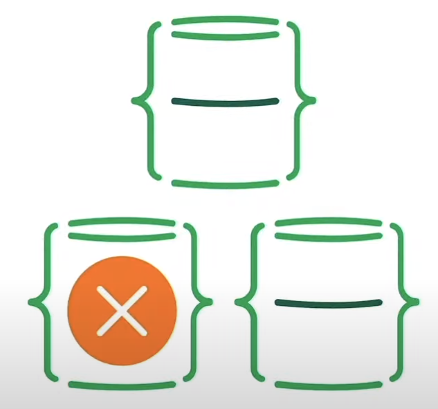

## Chapter 1: **What is MongoDB?**


MongoDB is a NoSQL database.


A NoSQL Database is a database that is structured and can be accessed in a different way to SQL databases, it doesn’t use a legacy approach of related tables of data, not in rows and columns. 

- The data in MongoDB DB is stored in Documents.
- Documents are stored in Collections.

<div class="mdx-image-container with-border wone g1" style="max-width: 430px; border-color: red;">



<figcaption class="gatsby-resp-image-figcaption">MongoDB actors</figcaption>
</div>


## What is a Document?


Is a way to organize and store data as a set of **field-value** pairs.


_Field_ - a unique identifier for a data point.


_Value_ - data related to a given identifier.


<div class="mdx-image-container with-border wone g1" style="max-width: 400px; border-color: red;">


</div>


### What is a Collection?


An organized store of documents in MongoDB, usually with common fields between documents. 


There can be many collections per-database and many documents per collection.


<div class="mdx-image-container with-border wone g1" style="max-width: 400px; border-color: red;">


</div>


### What is MongoDB Atlas?


Atlas is a cloud service that provides a fully managed database built for a range-wide of applications with MongoDB at its core.


It allows you to visualize, export, and more.


<div class="mdx-image-container with-border wone g1" style="max-width: 500px; border-color: red;">


</div>


### Cluster Deployment


Atlas users can deploy Clusters.


_Cluster_ - group of servers that store your data.


These Clusters are configured in Replica Set.


<div class="mdx-image-container with-border wone g1" style="max-width: 400px; border-color: red;">


<figcaption class="gatsby-resp-image-figcaption">On the left a Cluster, on the right a Replica Set</figcaption>
</div>


_Replica Set_ - a few connected MongoDB instances that store the same data to ensure that if something happens to one of the machines the data will remain intact. Comes from the word replicate - to copy something.


The major difference between a replica set and a cluster is:

- A replica set copies the data set as a whole.
- A cluster distributes the workload and stores pieces of data (shards) across multiple servers.

MongoDB allows users to combine these two functionalities by creating a **sharded cluster**, where each shard is replicated to a secondary server in order to provide high data availability and redundancy.


_Instance_ - a single machine locally or in the cloud, running certain software, in our case it is the MongoDB database.


<div class="mdx-image-container with-border wone g1" style="max-width: 200px; border-color: red;">


<figcaption class="gatsby-resp-image-figcaption">An Instance is a single machine</figcaption>
</div>


This setup ensures that if something happened to one of the machines in the Replica Set, the data will remain intact and available for use by the application by the remaining working member.


<div class="mdx-image-container with-border wone g1" style="max-width: 200px; border-color: red;">



<figcaption class="gatsby-resp-image-figcaption">One of the machines in the Replica Set is failing</figcaption>
</div>


Every time that you make a change to a document or collection, redundant copies of that data are stored within the replica set.


It means a copy of that document will exist on every machine in the Replica Set.


> ℹ️ To go deeper about ReplicaSet and Clusters, you can check this answer in StackOverflow: [What is the difference between a cluster and a replica set in MongoDB atlas?](https://stackoverflow.com/a/61661650/8112431)


**Services**

- Managed cluster creation
- Run and maintain database deployment
- Use the cloud provider of your choice
- Experiment with new tools and features

**Pricing**


<div class="mdx-image-container with-border wone g1" style="max-width: 400px; border-color: red;">


</div>


**Some free tier features**


<div class="mdx-image-container with-border wone g1" style="max-width: 450px; border-color: red;">


</div>


**Useful Links**:

- [MongoDB Replication: A Complete Introduction](https://www.bmc.com/blogs/mongodb-replication/)

## Chapter 2: Importing, Exporting, and Querying Data


### How documents are represented?


Documents are saved as BSON which is a binary representation of JSON. 


<div class="mdx-image-container with-border wone g1" style="max-width: 400px; border-color: red;">


<figcaption class="gatsby-resp-image-figcaption">A document JSON</figcaption>
</div>


JSON is:

- User friendly
- Readable
- Familiar

Cons of JSON:

- Text-based
- Space Consuming
- Limited number of data types.

BSON is optimized for:

- Speed
- Space
- Flexibility
- High performance
- General-purpose focus

<div class="mdx-image-container with-border wone g1" style="max-width: 500px; border-color: red;">


<figcaption class="gatsby-resp-image-figcaption">JSON vs BSON</figcaption>
</div>


The additional types in BSON allow for easing communication.


_MongoDB stores data in BSON internally and over the network, but this doesn’t mean you can’t think of MongoDB as a JSON Database._


_Anything you can represent in JSON can also be stored in MongoDB._ 


_We can retrieve and store data as JSON. Actually, with native SDK always use JSON, we don’t think about BSON, it’s just an internal feature that in our day-to-day we never think of._


Optional reading:

- [JSON vs BSON](https://www.mongodb.com/json-and-bson)
- [Read more about BSON](http://bsonspec.org/)

### Importing and Exporting Data


> Data is Stored in **BSON** but Viewed in **JSON  
>BSON** is great but isn’t human-readable


To learn more about other `mongoimport` supported formats [check out this documentation page](https://docs.mongodb.com/manual/reference/program/mongoimport/#compatibility).


_SRV connection string_ - a specific format used to establish a connection between your application and a MongoDB instance. [Click here to learn more.](https://docs.mongodb.com/manual/reference/connection-string/#connections-dns-seedlist)


Code used in this lecture:


```bash
mongodump --uri "mongodb+srv://<your username>:<your password>@<your cluster>.mongodb.net/sample_supplies"

mongoexport --uri="mongodb+srv://<your username>:<your password>@<your cluster>.mongodb.net/sample_supplies" --collection=sales --out=sales.json

mongorestore --uri "mongodb+srv://<your username>:<your password>@<your cluster>.mongodb.net/sample_supplies"  --drop dump

mongoimport --uri="mongodb+srv://<your username>:<your password>@<your cluster>.mongodb.net/sample_supplies" --drop sales.json

```


**Terminal Commands**


<div class="mdx-image-container with-border wone g1" style="max-width: 340px; border-color: red;">


</div>


**Exporting**


<div class="mdx-image-container with-border wone g1" style="max-width: 420px; border-color: red;">


</div>


**Importing**


<div class="mdx-image-container with-border wone g1" style="max-width: 420px; border-color: red;">


</div>


### Data Explorer


`mongosh` allows you to interact with your MongoDB instance without using a Graphical User Interface


<div class="mdx-image-container with-border wone g1" style="max-width: 500px; border-color: red;">


</div>


## **Chapter 3: Creating and Manipulating Documents**


### Inserting New Documents - ObjectId


Every document must have a **unique** `_id` value.


**Optional Reading**


If you want to read more about the ObjectId data type, and the ObjectId() function, which generates ObjectId values, [check out this excellent documentation page](https://docs.mongodb.com/manual/reference/method/ObjectId/index.html#objectid).


Every document can have a different structure, nothing prevents you from doing this. Either is a good practice to know how to organize your data.


The default value of `_id` field is `ObjectId()` unless otherwise is specified.


Idential documents can exist in the same collection as long as their `_id` values are different.


MongoDB has schema validation functionality allow you to enforce document structure.


### Inserting New Documents - insert() order


Insert in order, which means if something fails, it will fail and will not continue with the next item.


```bash
db.inspections.insert([{ "_id": 1, "test": 1 },{ "_id": 1, "test": 2 },{ "_id": 3, "test": 3 }])
```


We can avoid this behaviour by adding the option `{ ordered: false` 


```bash
db.inspections.insert([{ "_id": 1, "test": 1 },{ "_id": 1, "test": 2 }, { "_id": 3, "test": 3 }], { ordered: false } )
```


### Updating Documents - mongo shell


<div class="mdx-image-container with-border wone g1" style="max-width: 500px; border-color: red;">


</div>


### Deleting Documents and Collections


<div class="mdx-image-container with-border wone g1" style="max-width: 500px; border-color: red;">


</div>


We can delete a collection by doing:


```bash
db.collection_name.drop()
```


When we delete all collections from a database, the database will be removed as well.


**Update operators**


Example: `$inc` `$set` `$unset`


## **Chapter 4: Advanced CRUD Operations**


### Query Operators - Comparison


Query operators provide additional ways to locate data within the database


Comparison operators specifically allow us to find data within a certain range.


If a comparison operator is not specified, `$eq` is used as default operator.


Check the list of comparison operators [here](https://docs.mongodb.com/manual/reference/operator/query/#comparison).


### [Query Operators - Logic ](https://docs.mongodb.com/manual/reference/operator/query-logical/)


Structure:


**And**


And is implicit:


Here, and is implicit.


### Expressive Query Operator


`$` denotes the use of an operator


`$` addresses the field value


Class: [https://university.mongodb.com/mercury/M001/2022_January_18/chapter/Chapter_4_Advanced_CRUD_Operations/lesson/5f36f78304e9ffa9eb9deb79/lecture](https://university.mongodb.com/mercury/M001/2022_January_18/chapter/Chapter_4_Advanced_CRUD_Operations/lesson/5f36f78304e9ffa9eb9deb79/lecture)


### Array Operators


### Array Operators and Projection


## **Chapter 5: Indexing and Aggregation Pipeline**


Another way to create queries. 


Get into the bus at 1st St. then


### $group


Recap:


### sort() and limit()


`sort` and `limit` are cursor methods. 


A cursor method is not applied to the data in the database, instead applied to the results in the cursor after `find` command. 


You can sort in increasing or decreasing order:


### Introduction to Indexes


### Introduction to Data Modeling


_Data modeling_ - a way to organize fields in a document to support your application performance and querying capabilities.


To learn more about data modeling with MongoDB, take our [Data Modeling Course](https://university.mongodb.com/courses/M320/about)! Check out our [documentation](https://docs.mongodb.com/manual/core/data-modeling-introduction/) and [blog](https://www.mongodb.com/blog/post/building-with-patterns-a-summary).


### Upsert - Update or Insert?


```bash
Aggregation Framework

1. Using the aggregation framework find all documents that have Wifi as one
   of the amenities. Only include price and address in the resulting cursor.

2. Which countries have listings in the sample_airbnb database?
3. How many countries have listings in the sample_airbnb database?

sort() and limit()

1. Find the least populated ZIP code in the zips collection.
2. Find the most populated ZIP code in the zips collection.
3. Find the top ten most populated ZIP codes.
4. Get results sorted in increasing order by population, and decreasing
   order by city name.

Introduction to Indexes

Create two separate indxes to support the following queries:

db.trips.find({"birth year": 1989})

db.trips.find({"start station id": 476}).sort("birth year": 1)
```


[Documentation about the Validation tab in Compass](https://docs.mongodb.com/compass/current/validation/).


[Schema Validation with MongoDB](https://docs.mongodb.com/manual/core/schema-validation/) Documentation.


[JSON Schema Validation - Locking down your model the smart way](https://www.mongodb.com/blog/post/json-schema-validation--locking-down-your-model-the-smart-way).


[JSON Schema Validation - Checking Your Arrays](https://www.mongodb.com/blog/post/json-schema-validation--checking-your-arrays)


# Why MongoDB? (optional)


At this point you have learned enough to start having a meaningful conversation about why developers, DBAs, and companies choose MongoDB as their database.


This can also help you decide whether MongoDB is the right choice for you.


To help you learn more about specific use cases, we put together case studies and articles about some of our customers and community members.


We also added a link to the MongoDB Developer Hub and Community Forums where you can ask questions, learn new things, and connect with others who are diving into MongoDB content and products.


Take a look and feel free to browse for more information.

- [MongoDB Developer Hub](https://developer.mongodb.com/)
- [MongoDB Community Forums](https://developer.mongodb.com/community/forums/)
- [Case study: Bosch Leads Charge into Internet of Things](https://www.mongodb.com/customers/bosch)
- [Case study: Forbes](https://www.mongodb.com/blog/post/forbes-cloud-migration-helps-worlds-biggest-media-brand-continue-standard-digital-innovation)
- [Case study: SEGA](https://www.mongodb.com/blog/post/sega-hardlight-migrates-to-mongodb-atlas-simplify-ops-improve-experience-mobile-gamers)
- [How the Financial Sector Uses MongoDB](https://www.mongodb.com/industries/financial-services)

