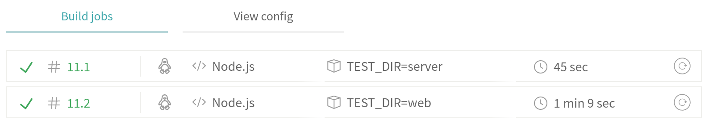

### Lo primero: ¿Qué son los monorepos?

Los repositorios multiproyectos o [monorepos](https://en.wikipedia.org/wiki/Monorepo) es una forma de organizar nuestro proyecto de tal forma que contenga **múltiples subproyectos** y sean sea controlados por un solo repositorio de un [Sistema de Control de Versiones](https://en.wikipedia.org/wiki/Version_control) como Git por ejemplo.

### ¿Qué es TravisCI?

> Travis CI es un servicio de integración continua alojado que se utiliza para construir y testear proyectos de software alojados en GitHub. fuente: [Wikipedia](https://en.wikipedia.org/wiki/Travis_CI).

### Configurar TravisCI para monorepos


#### Activar repositorio


> Para este caso asumire que ya tienes una cuenta de Github, si no es asi puedes crearte una [aqui](https://github.com).

Si no tienes una cuenta en TravisCI puedes loguearte con tu cuenta de Github ingresando a https://travis-ci.org.

Una vez dentro añadimos un nuevo repositorio haciendo click en el boton con el simbolo `+`:


Y activamos el repositorio:


#### Estructura del repositorio

Para configurar la integracion continua en un monorepo tomaremos como 
ejemplo [este repositorio](https://github.com/dantehemerson/audio-tag-editor/tree/575f0f92ee0a4fa4ca8c296b8aea1a370a228ad8) que tiene la siguiente estructura: 

```js
.
├── server
│ ├── ...
│ └── package.json
├── web
│ ├── ...
│ └── package.json
└── .travis.yml
```

Tenemos dos carpetas(subproyectos) y cada uno tiene un `package.json` que contiene la informacion y las dependencias de cada subproyecto.


#### Archivo de configuracion para TravisCI

La configuracion para TravisCI se hace en el archivo `.travis.yml` que tiene la siguiente forma:

```yml:title=.travis.yml
language: node_js
env:
  - TEST_DIR=server
  - TEST_DIR=web
script: cd $TEST_DIR && yarn && yarn test
```

En la primera linea tenemos el lenguaje sobre el cual se ejecutara el proyecto, en este caso `node_js`:

```yml{1}:title=.travis.yml
language: node_js
env:
  - TEST_DIR=server
  - TEST_DIR=web
script: cd $TEST_DIR && yarn && yarn test
```

Luego en el campo `env` declaramos las variables de entorno.
Tenemos que colocar cada uno de nuestros subproyectos dentro del campo `env`. 

Es importante que coloquemos **misma clave** para 
todos los nombres de las carpetas, en este caso es `TEST_DIR`:

```yml{2-4}:title=.travis.yml
language: node_js
env:
  - TEST_DIR=server
  - TEST_DIR=web
script: cd $TEST_DIR && yarn && yarn test
```

Finalmente el campo `script` define los comandos que se ejecutaran para cada uno de los subproyectos.

```yml{5}:title=.travis.yml
language: node_js
env:
  - TEST_DIR=server
  - TEST_DIR=web
script: cd $TEST_DIR && yarn && yarn test
```

Como vemos estamos usando la variable de entorno `$TEST_DIR` dentro del script por lo que se generaran un build independiente para cada una de las variables de entorno con clave `$TEST_DIR`, es decir:

```bash
cd server && yarn && yarn test
cd web && yarn && yarn test
```

Lo que hace este comando es moverse al directorio `$TEST_DIR`, luego ejecutar `yarn` que instala las dependencias de un proyecto
y finalmente ejecutar `yarn test` que ejecuta el comando de tests definido dentro del `package.json`.

#### Resultados:

Finalmente luego de enviar los cambios al repositorio de Github, podemos ver el [siguiente resultado](https://travis-ci.org/dantehemerson/audio-tag-editor/builds/579281934) en la pagina de TravisCI.


Como podemos ver se han creado **2** jobs uno para `server` y el otro para `web`:



### Conclusion

TravisCI y Github hacen una integracion increible que nos permite tener un buen entorno de CI.
Finalmente si quieres aprender mas sobre TravisCI te invito nuevamente a revisar su [documentacion](https://docs.travis-ci.com/) que esta increible.


Gracias por llegar hasta el final de este post 🤗, si te gusto este post puedes seguirme en [twitter](https://twitter.com/dantehemerson)
donde estare compartiendo los nuevos posts que publique.
